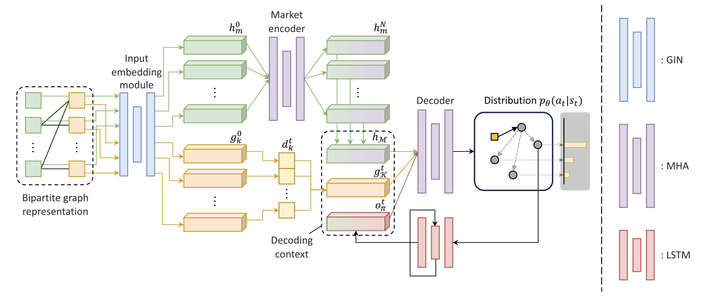

# Deep Reinforcement Learning for Traveling Purchaser Problems

This repository contains the code for paper: [Deep Reinforcement Learning for Traveling Purchaser Problems](https://ieeexplore.ieee.org/document/11059335) (*IEEE Transactions on Emerging Topics in Computational Intelligence*).

<p align="center">
    
</p>

## Requirements

- python 3.10
- dgl 1.1.2
- pytorch 2.0.1
- ortools 9.11
- numpy 1.25.2 
- packaging 23.0
- setuptools 60.0
- tqdm 4.65.0
- tensorboard-logger 0.1.0
- protobuf 3.20.3

## Usage

First download the [data](https://drive.google.com/file/d/1vSdvV4Ivu_g-CDGGzWja2HQcmGcOclnk/view?usp=drive_link) and unzip it to the main folder.

#### Evaluation

The pretrained models for UTPP and RTPP of size $(|M|,|K|)=(50, 50)$ to $(100, 100)$ are available in the `ckpt` folder. Below is examples to run the evaluation on synthetic TPP instances.

For UTPP of size $(|M|,|K|)=(50, 50)$:

```
python -m evaluation.utpp.eval --graph_size 50 --num_products 50 --model_path ckpt/utpp_50_50/pretrain.pt
```

For RTPP of size $(|M|,|K|, \lambda)=(50, 50, 0.99)$:

```
python -m evaluation.rtpp.eval --graph_size 50 --num_products 50 --coeff 0.99 --model_path ckpt/rtpp_50_50_0.99/pretrain.pt
```

Below is examples to run the evaluation on TPPLIB benchmark instances.

For UTPP of size $(|M|,|K|)=(50, 50)$:

```
python -m evaluation.utpp.benchmark --graph_size 50 --num_products 50 --model_path ckpt/utpp_50_50/pretrain.pt
```

For RTPP of size $(|M|,|K|, \lambda)=(50, 50, 0.99)$:

```
python -m evaluation.rtpp.benchmark --graph_size 50 --num_products 50 --coeff 0.99 --model_path ckpt/rtpp_50_50_0.99/pretrain.pt
```

***Remark:** The results obtained may differ slightly from those as reported in the paper. This is because the TSP solver used in the experiments is [Concorde](https://www.math.uwaterloo.ca/tsp/concorde.html), while this repository applies [Google OR-Tools](https://developers.google.com/optimization) for ease of use, whose performance is slightly inferior to Concorde. You can refer to [PyConcorde](https://github.com/jvkersch/pyconcorde) to use Concorde in Python.*

#### Training

To train a model for a single TPP instance distribution, you can run (take RTPP of $(50, 50, 0.99)$ as an example):

```
python -m train_single.run --problem rtpp --num_products 50 --num_products 50 --coeff 0.99
```

To train a model using meta-learning, you can run (take UTPP and RTPP with $\lambda=0.99$ as an example):

```
python -m train_meta.run --problem utpp
python -m train_meta.run --problem rtpp --coeff 0.99
```

## Contact
If you have any problems, please feel free to contact the authors. Haofeng Yuan: yhf22@mails.tsinghua.edu.cn.
